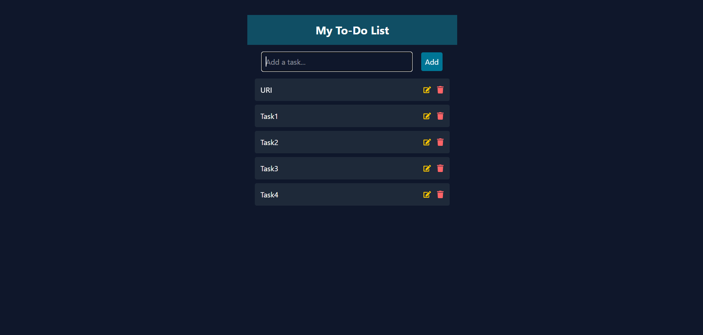

# 📝 To-Do List App

A simple **To-Do List** application built with **React** and **Tailwind CSS**, featuring:
- Add, edit, delete tasks
- Mark tasks as completed
- Persistent storage using **Local Storage**
- Mobile, tablet, and desktop responsive layout

--------------------

## 📸 Preview



--------------------

## 🚀 Features
- ✅ Add new tasks easily
- ✏️ Edit tasks in place
- 🗑 Delete tasks instantly
- ✔ Mark as completed with a click
- 💾 Data saved in localStorage (persists after page reload)

--------------------

## 🚀 Getting Started

### 1. Clone the Repository

```bash
git clone https://github.com/Krishn77777/ToDo_List.git
cd Weather_Forecast
